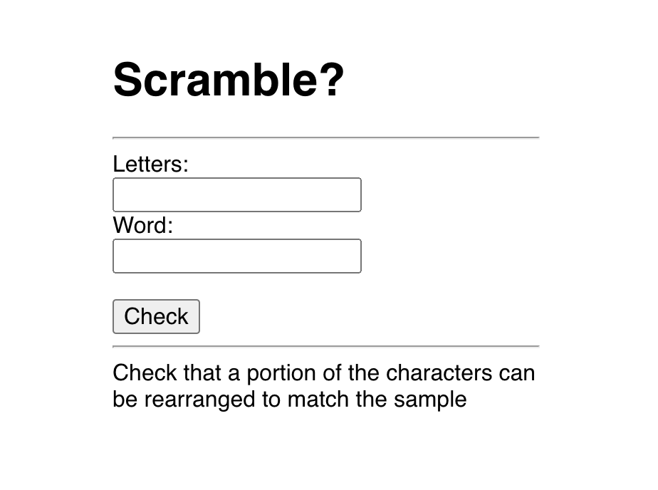

# Scramble?

Minimal full stack Clojure/Script application

## Overview

Check that a portion of the letters can be rearranged to match the word

## Setup

To run a server:

    clj -X scramble.server/run

To install client deps:

    npm install -g shadow-cljs
    npm install

To run a client:

    npx shadow-cljs watch app

and open your browser at [localhost:8000](http://localhost:8000/).